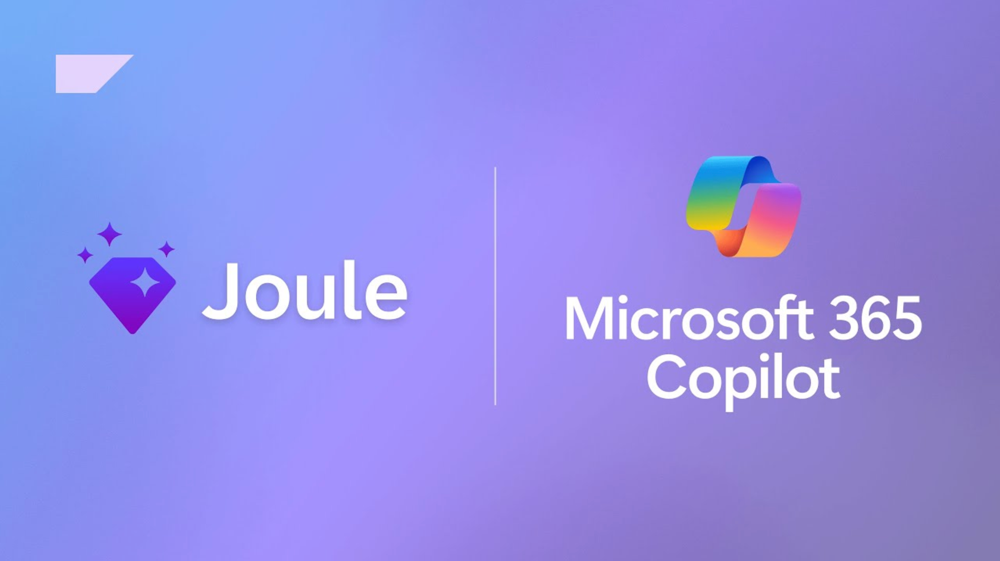
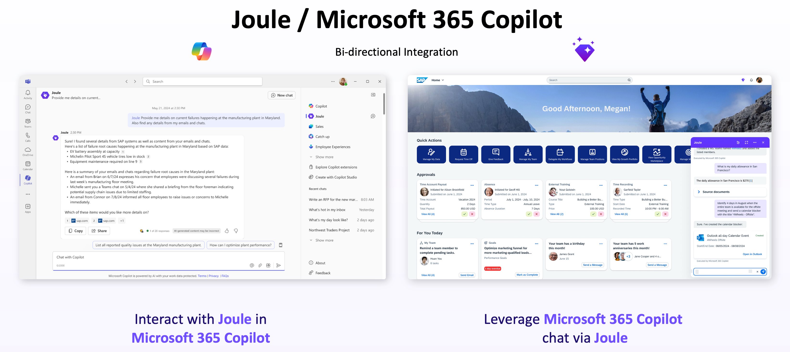
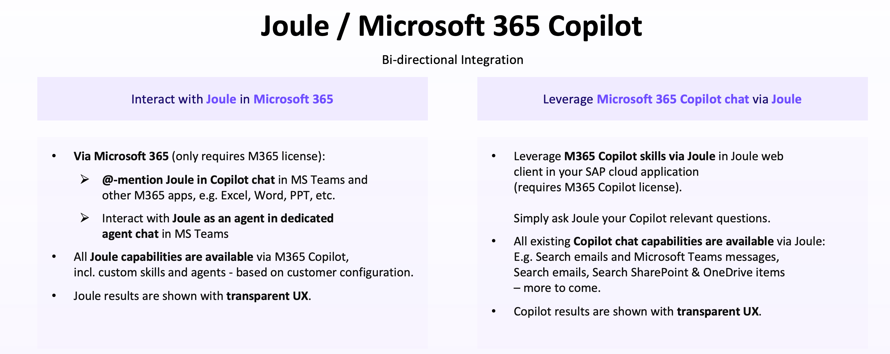

# Industry First Bidirectional Copilot to Copilot integration

SAP and Microsoft are redefining workplace productivity by integrating Joule and Microsoft 365 Copilot for a seamless user experience. The deep bi-directional integration allows employees to get more done in the flow of their work through seamless access to information from interactions with business applications in SAP, as well as Microsoft 365.

Employees can access either Joule or Microsoft 365 Copilot to complete tasks and retrieve data across both SAP and Microsoft environments. This means that users in Microsoft 365 can rely on Copilot to pull SAP tasks and data through Joule, while those in SAP applications can leverage Joule to access Microsoft 365 information and workflows.

By integrating **Joule** and Microsoft 365 Copilot, you can leverage the Joule capabilities from within Microsoft 365 Copilot Business Chat. **Joule** is made available as a [Custom Engine Agent within Microsoft 365 Copilot](https://help.sap.com/docs/link-disclaimer?site=https%3A%2F%2Fappsource.microsoft.com%2Fen-us%2Fproduct%2Foffice%2Fwa200008645 "https://appsource.microsoft.com/en-us/product/office/wa200008645"), and can be reached either via @-mentioning or selecting the Joule agent directly. It only requires Microsoft 365 license.

In addition, if you have Microsoft 365 **Copilot** license, you can leverage M365 Copilot skill via Joule, all Microsoft Copilot chat capabilities are avialable via Joule as well.

For more information about integrating **Joule** with Microsoft 365 Copilot, see [Integrating Joule with Microsoft 365 Copilot](https://help.sap.com/docs/joule/serviceguide/45e659a613b84ce89d0c6f8db3df2474.html?locale=en-US&state=PRODUCTION&version=CLOUD).
