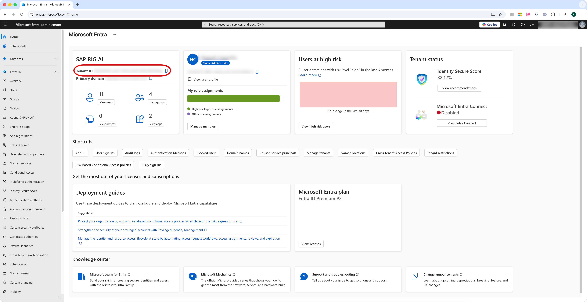
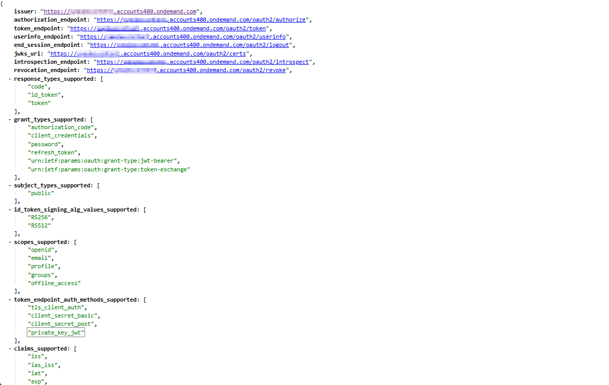

# Collect the Required Information

In the following sections you need to know the issuer URLs for your SAP Cloud Identity Services tenant and your Microsoft Entra ID tenant. We use the following placeholders for these URLs.

* Entra ID issuer: ***{entraid_issuer}***
* SAP Cloud Identity Services issuer: ***{cloud_identity_issuer}***

## Issuer and Tenant ID of Your Entra ID Tenant

You can derive your Entra ID issuer from the tenant ID and the following URL pattern:

***{entraid_issuer}*** = https://login.microsoftonline.com/***{entraid_tenant_id}*** /v2.0

### Get the Tenant ID of Your Microsoft Entra ID Tenant

Go to the Microsoft Entra Admin Center with the admin user role.

1. Go to **Home** page.
2. Note down the **Tenant ID** .
   Use this value for the placeholder ***{entraid_tenant_id}*** .

   

## Issuer and Subdomain of Your SAP Cloud Identity Services Tenant

In the SAP public cloud offering, the issuer of your SAP Cloud Identity Services tenant follows one the following patterns:

* ***{cloud_identity_issuer}*** = https://***{cloud_identity_tenant_subdomain}.*** accounts.ondemand.com (default)
* ***{cloud_identity_issuer}*** = https://***{cloud_identity_tenant_subdomain}.*** accounts.cloud.sap
* ***{cloud_identity_issuer}*** = https://***{custom-domain}***

**Note:**

* The ***{cloud_identity_issuer}*** doesn't have a trailing slash.
* For SAP private cloud offerings, the values may differ.
  Alternatively, you can find all domains of your SAP Cloud Identity Services tenant in the admin console under **Applications & Resources > Tenant Settings > Single Sign-On > OpenID Connect Configuration > Identity Provider Settings** .
  Under **Domain for Browser Flows** you find the value **Default** in addition to the list of all domains under which the SAP Cloud Identity Services tenant can be reached.

### Get the Issuer for SAP Cloud Identity Services

1. Open the OpenID Connect configuration endpoint in your browser using one of the domains under which you typically access your SAP Cloud Identity Services tenant and add the path **.well-known/openid-configuration** .
   For SAP public cloud the URL use the following pattern:
   **https://*{cloud_Identity_tenant_subdomain}* .accounts.ondemand.com/.well-known/openid-configuration**
2. Use the value provided for **issuer** as ***{cloud_identity_issuer}***.

   
