# Configure Microsoft Entra

Go to the Entra ID Admin Center with the admin user role.

## Register the Federation App

1. Go to **Entra ID -> App registrations** .
2. Choose **New registration** .

   
3. Enter a meaningful name such as **Federation with *{cloud_identity_issuer}*** .
4. Under **Redirect URI (optional)** , choose **Web** .
5. Enter the following redirect URI: ***{cloud_identity_issuer}* /oauth2/callback** .
   Replace the placeholder with the proper value.
6. Choose **Register**.

   
7. Note down the **Application (client) ID** and the **Directory (tenant) ID** .
   You need the application ID later in this blog and the follow up blog. The directory ID is needed only in the follow up blog.

## Configure Redirect URIs

In case the Entitlements are not found in your SAP BTP Global Account, and if the order is processed, it could be that you have Multiple SAP BTP Global Accounts, and the license could have been assigned to the other account. Please reach the SAP BTP CSM or AE for support.

Add all remaining redirect URIs that are supported by your SAP Cloud Identity Services tenant to the application registration. See the previous section **Issuer and Subdomain of Your SAP Cloud Identity Services Tenant** .

1. Go to **Authentication (Preview)** .
2. Choose **Add Redirect URI**  **>** **Web**.

   
3. Add the additional redirect URIs.

   * For SAP public cloud, enter:
     * https://***{cloud_identity_tenant_subdomain}*** .accounts.ondemand.com/oauth2/callback
     * https://***{cloud_identity_tenant_subdomain}*** .accounts.cloud.sap/oauth2/callback
   * When using a custom domain, enter: https://***{custom-domain}*** /oauth2/callback
4. Save your entries by clicking the **Configure**

   

## Add Federated Credentials

1. Choose **Certificates & secrets**.
2. Choose **Federated credentials** and choose **Add credential** .

   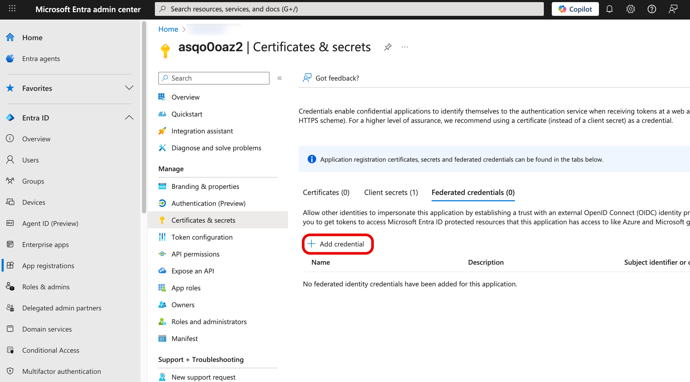
3. Under **Federated credential scenario** , choose **Other issuer** .

   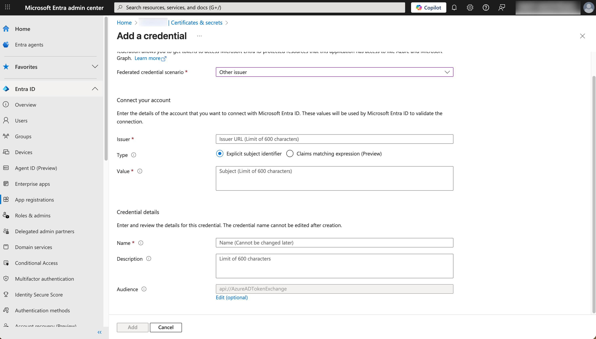
4. Under **Connect your account** , enter the following values for the parameters:

   | **Parameter** | **Value**                                                                                                                                                |
   | --------------- | ---------------------------------------------------------------------------------------------------------------------------------------------------------- |
   | Issuer        | ***{cloud_identity_issuer}***                                                                                                                            |
   | Type          | Explicit subject identifier                                                                                                                              |
   | Value         | Federation with Entra ID**Note:** Remember this value. You'll need this value later when you configure SAP Cloud Identity Services to trust this tenant. |
5. Under **Credential Details** , enter the following values for the parameters:

   | **Parameter** | **Value**                 |
   | --------------- | --------------------------- |
   | Name          | Credential-for-SCI-Tenant |
   | Description   | Credential-for-SCI-Tenant |
   | Audience      | ***{entraid_issuer}***    |

   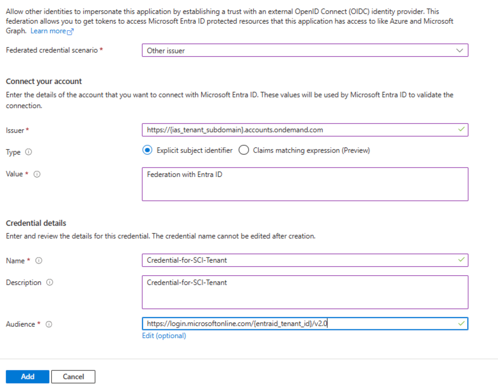
6. Choose **Add**.

## Configure Tokens

1. Go to **Token configuration**.
2. Choose **Add optional claim**.
3. Under **Token type** , choose **Access**.
4. Enable the **email** claim and choose **Add**.

   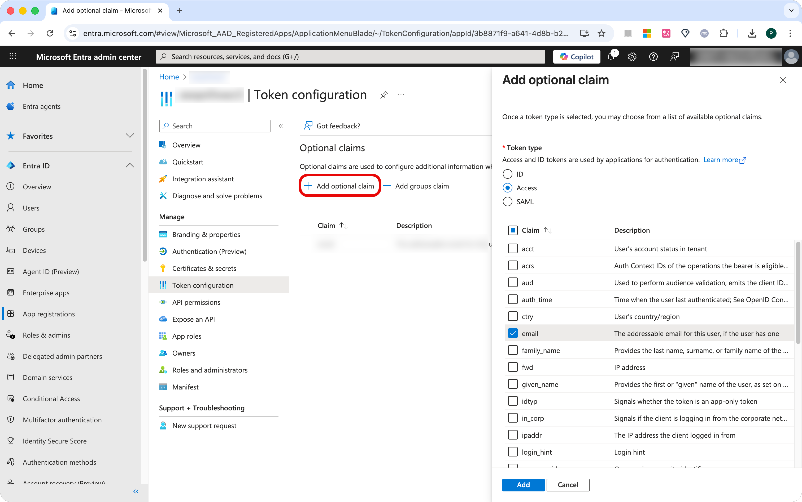
5. Choose **Add**.

   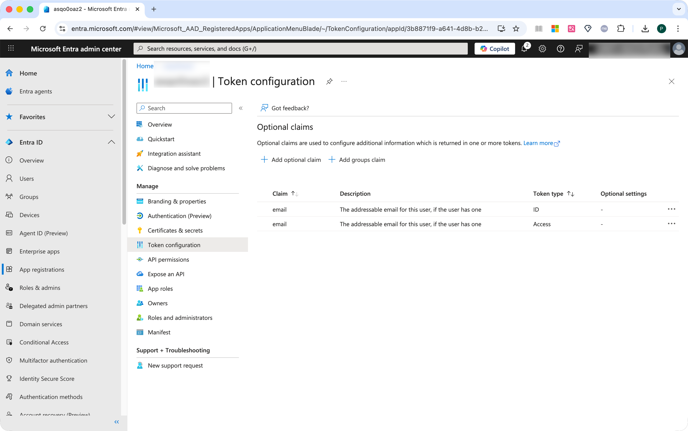

## Add API Permissions

1. Go to **API permissions**.
2. Choose **Add a permission**.
3. Choose **Microsoft Graph**.

   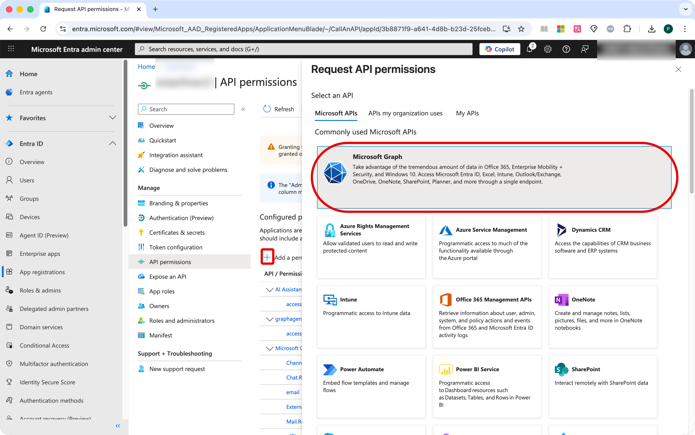
4. Choose **Delegated permissions**.

   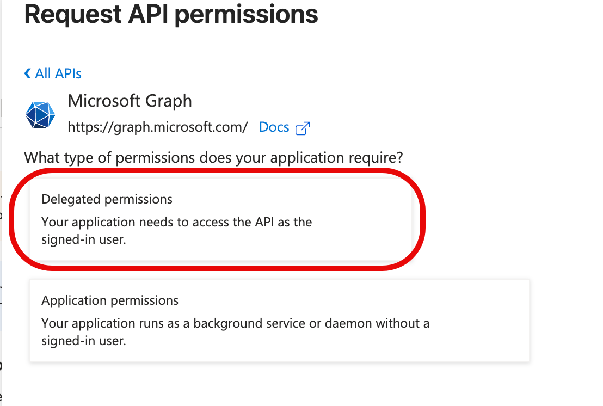
5. Under **OpenId permissions** enable all 4 permissions: **email, offline_access, openid, profile**.

   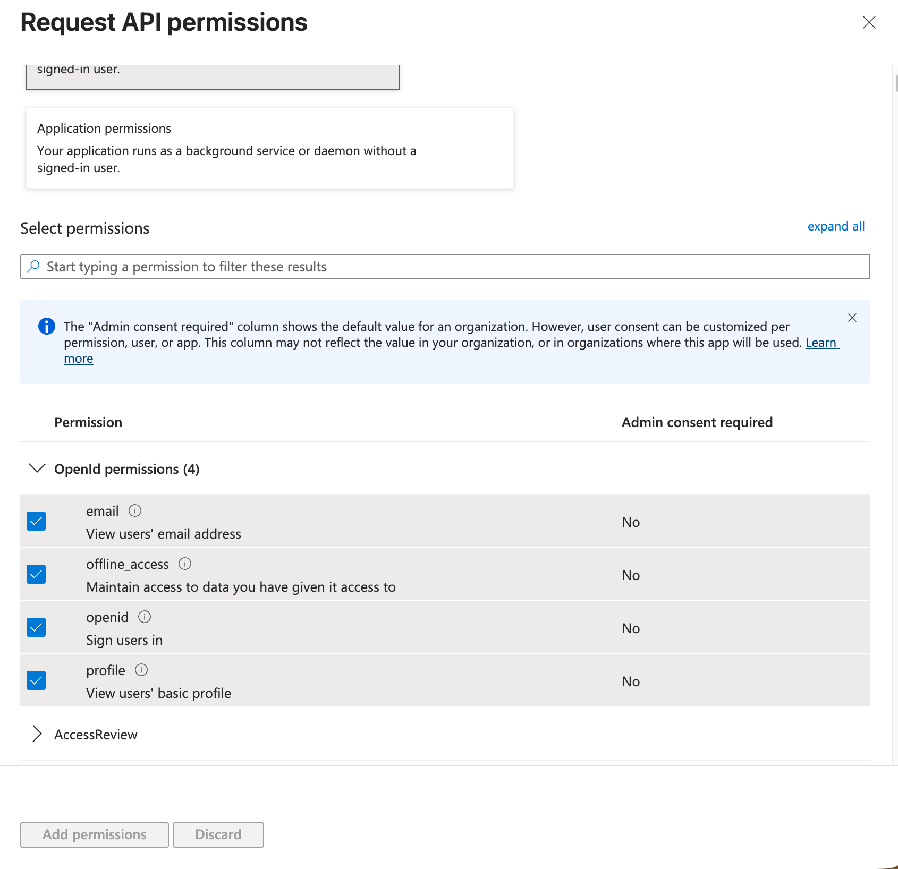
6. Choose **Add permissions**.
   The console displays the new permissions in the **Configured permissions ** table. Some of the permissions may not be granted yet.
7. Choose** Grant admin consent for {your_Entra_ID_tenant}**.

   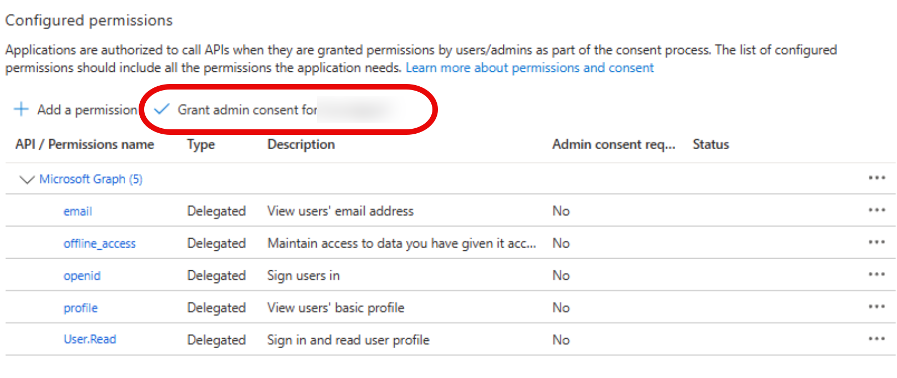
8. Choose **Yes**.
9. Verify that all permissions have the **granted** status.

   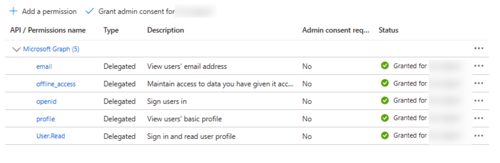

## Add Manifests

1. Go to **Manifest** .
2. Choose **Microsoft Graph App Manifest (new)** .
3. Search for** requestedAccessTokenVersion ** and set its value to **2** .
4. Save your entries.

   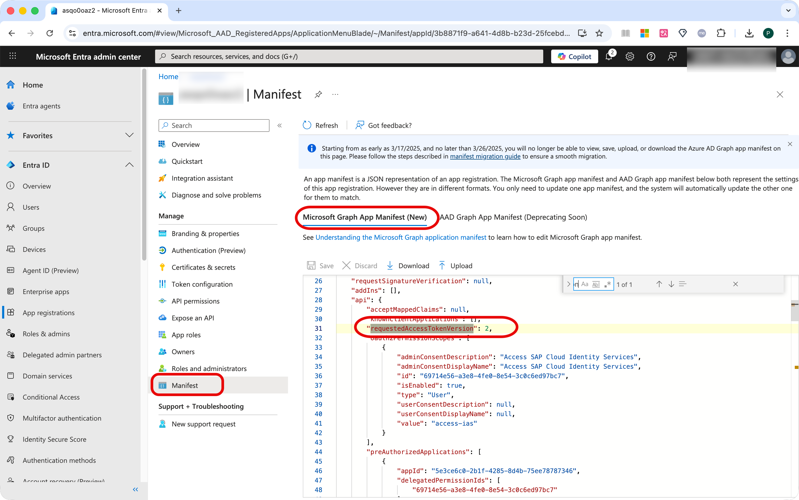
5. Choose** AAD Graph App Manifest (Deprecating Soon)** .
6. Search for **accessTokenAcceptedVersion** and set its value to **2** .
7. Save your entries.

   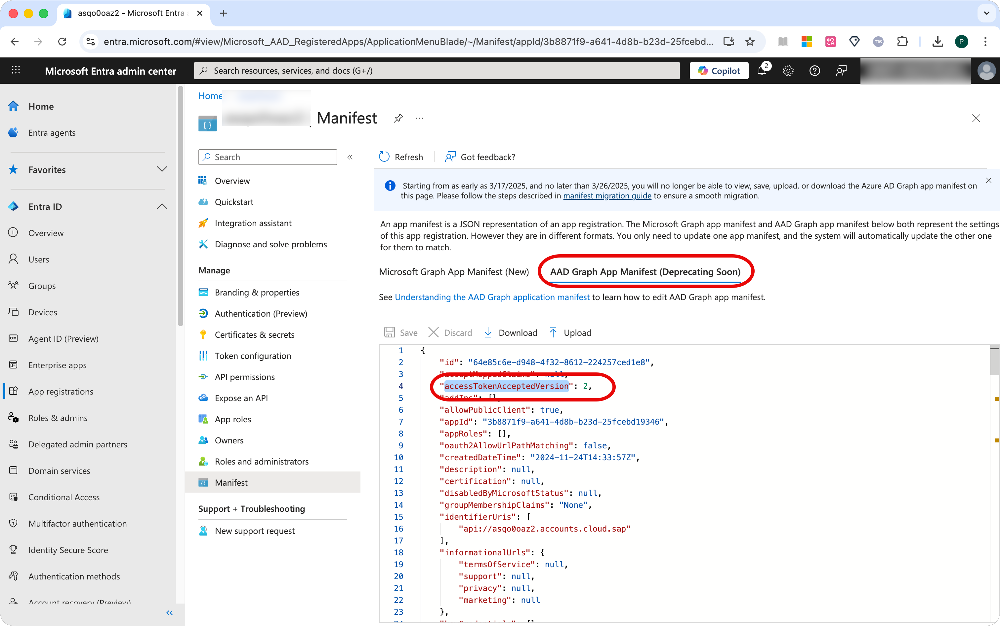

## Expose APIs

1. Go to **Expose an API** .
2. Under **Application ID URI** , choose **Add** .
3. Enter the URI using the following pattern:
   api://***{cloud_identity_tenant_subdomain}.*** accounts.cloud.sap
   **Note:** Make sure that this identifier ends with **.accounts.cloud.sap**!
4. Save your entries.

   
5. Under **Scopes defined by this API** , choose **Add a scope** .
6. In the **Scope name** fied, enter **access_as_user** .
7. Provide a consent display name and a consent description.
8. Choose** Add scope** .

   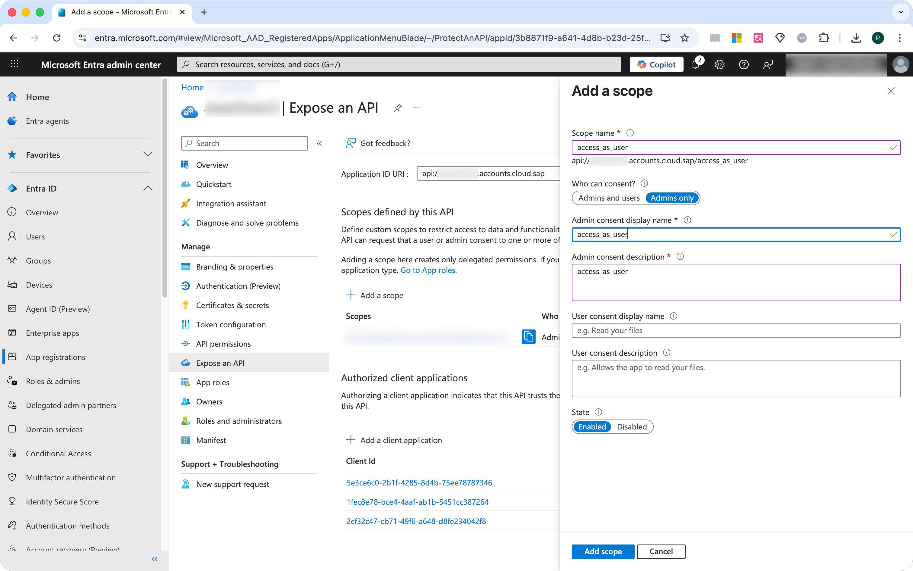
