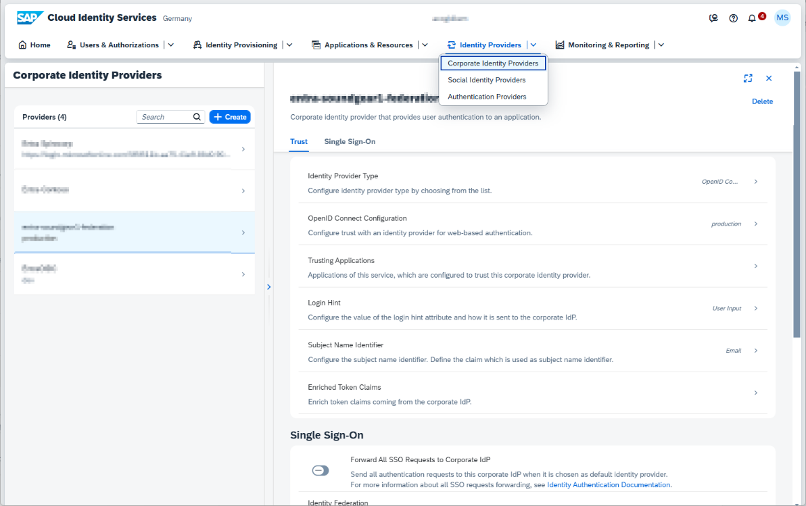
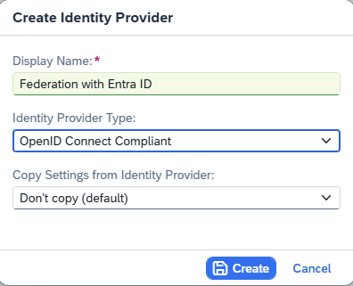
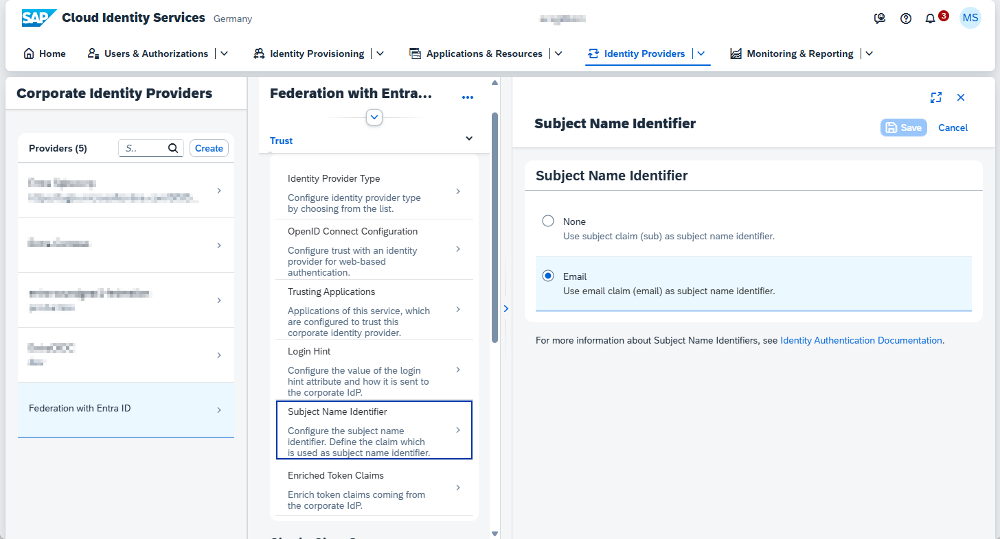
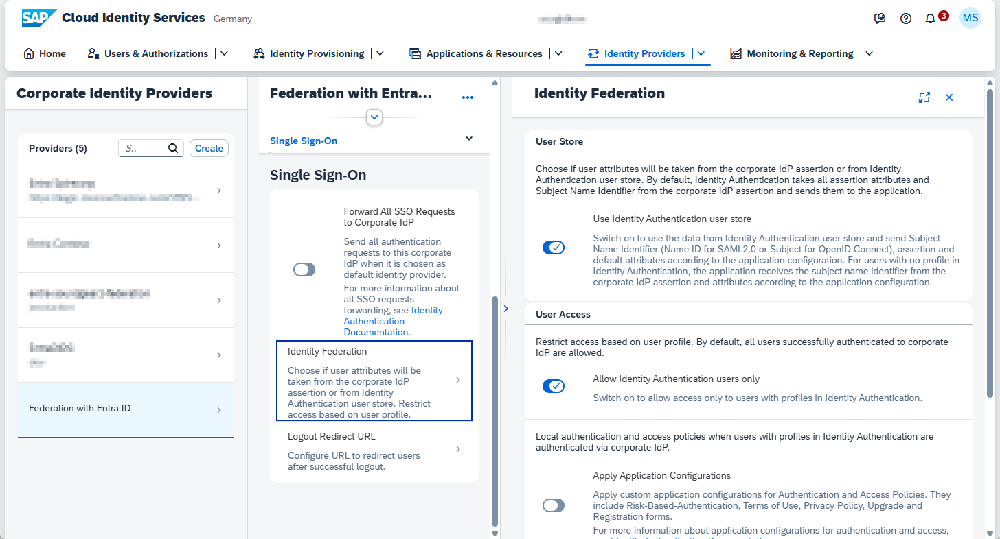
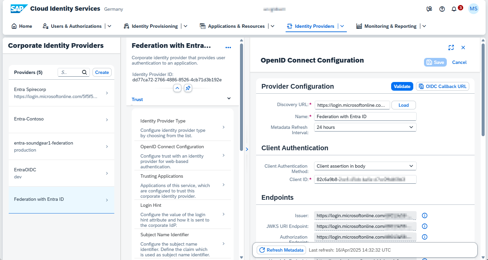
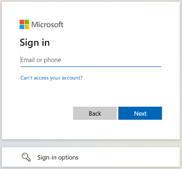
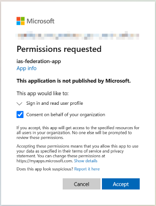
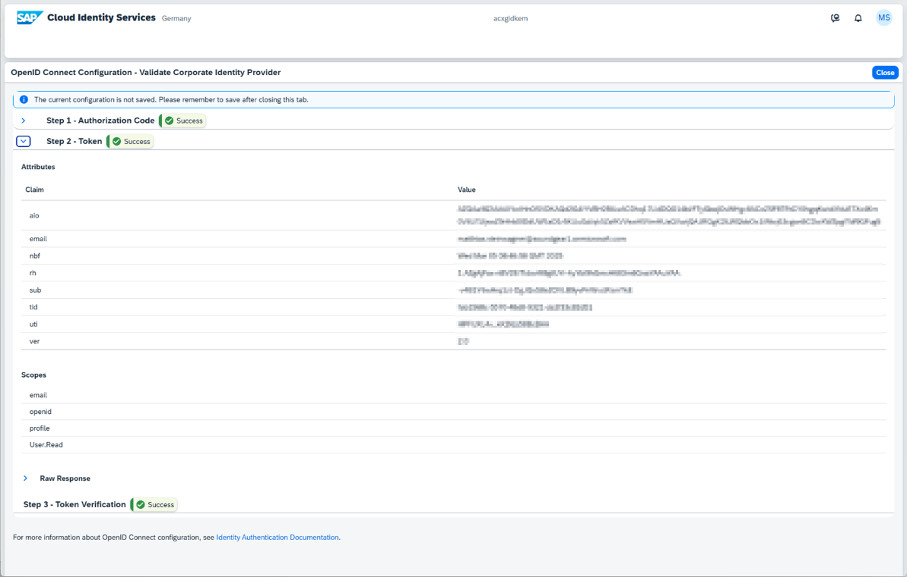

# Configure SAP Cloud Identity Services

You must know the ***{entraid_issuer}*** and **ApplicationId** , which you noted down during the registration of your federation app in Microsoft Entra ID.

Go to the SAP Cloud Identity Services Administration Console with the admin user role.

## Create a Corporate Identity Provider

1. Go to **Identity Providers** **> Corporate Identity Providers**.
2. Choose **Create**.

   

      
   
3. Enter the following values:

   | **Field**                            | **Value**                |
   | -------------------------------------- | -------------------------- |
   | Display Name                         | Federation with Entra ID |
   | Identity Provider Type               | OpenID Connect Compliant |
   | Copy Settings from Identity Provider | Don’t copy (default)    |
4. Choose **Create** .

   

      

## Configure Subject Name Identifier

1. Choose **Trust > Subject Name Identifier** .
2. Choose **Email** .
3. Save your entries.

   

      

## Configure Identity Federation

1. Choose **Trust > Single Sign-On >** **Identity Federation** .
2. Enable **Use Identity Authentication user store** .
3. Enable **Allow Identity Authentication users only** .

   

      

## Configure OpenID Connect

In this step, you must know the values for ***{entraid_issuer}*** *and*** ApplicationId** which you noted down during the registration of your federation app in Microsoft Entra ID.

1. Choose **Trust >** **OpenID Connect Configuration** .
2. Under **Provider Configuration** , enter the following:

   | **Field**                 | **Value**                                                                                                                                                                                                                                                                                    |
   | --------------------------- | ---------------------------------------------------------------------------------------------------------------------------------------------------------------------------------------------------------------------------------------------------------------------------------------------- |
   | Discover URL              | ***{entraid_issuer}*** /v2.0/.well-known/openid-configuration                                                                                                                                                                                                                                |
   | Name                      | Federation with Entra ID**Note:** The value of this field must the same as the **Value** field configured in the federated credential in Microsoft Entra ID. If you leave this field empty, the system will enter the value for you when you load the configuration later in this procedure. |
   | Metadata Refresh Interval | 24 hours                                                                                                                                                                                                                                                                                     |
3. Under **Client Authentication >** **Client Authentication Method ** choose **Client assertion in body** .
4. Under **Client Authentication >** **Client ID** , enter the **ApplicationId** from the federation app in Microsoft Entra ID.
5. Add the following** Scopes** :

   * **email**
   * **profile**
   * **offline_access**
6. Chose **Load** (next to the **Discovery URL** ).
   The system reads the value of the Value field associated with the name configured in the federated credential on Microsoft Entra ID and enters the value as the name of the provider configuration, as long as you didn't enter a name previously. The system also enters the endpoints for the configuration.
7. Save your entries.

   

      

## Validate the Configuration in SAP Cloud Identity Services

1. In the **OpenID Connect Configuration** of your corporate identity provider, choose **Validate** .
   A new tab appears with a sign in prompt from Microsoft Entra ID.
2. Sign on with a user with an admin role.
   If asked to grant permissions, choose **Accept** .

   

      
   

      
3. :exclamation:Verify the success of the validation.

   * **Step 1 – Authorization Code** shows Success.
   * **Step 2 – Token** shows Success.
     The following Scopes are listed: **email, openid, profile, User.Read** .
   * **Step 3 – TokenVerification** shows Success.

      

         

Recap: Configure SAP Cloud Identity Services to trust Microsoft Entra ID by creating a corporate identity provider, setting OpenID Connect parameters with the Entra issuer and Application ID, enabling identity federation, and validating the integration.
