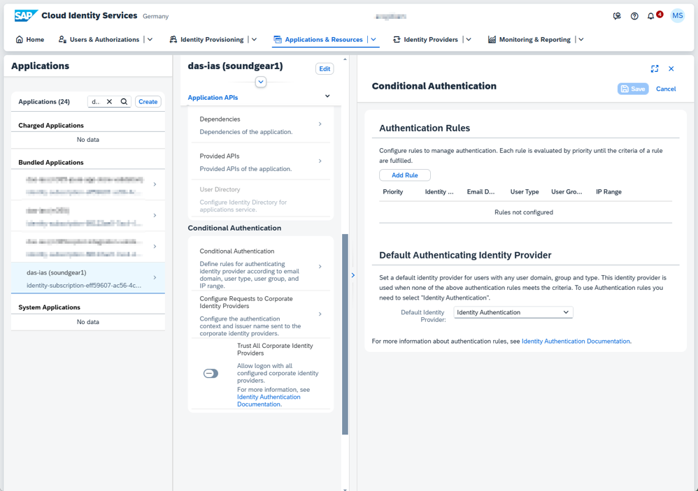
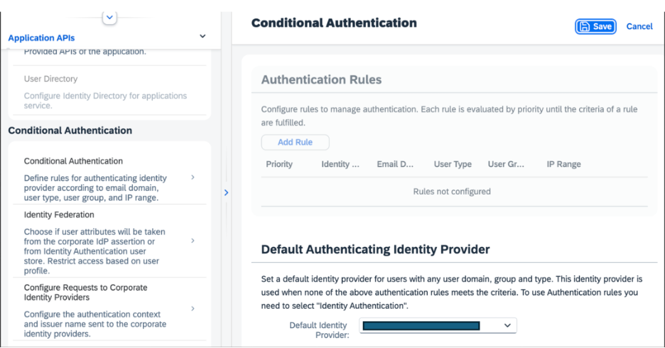
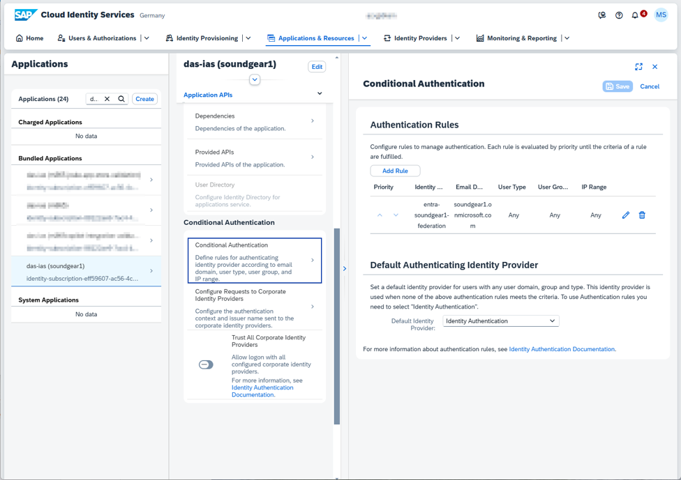
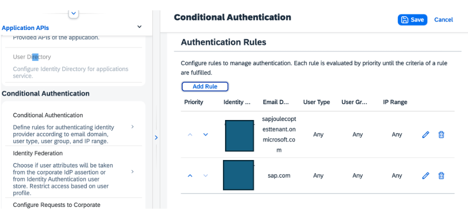

# Configure Microsoft Entra ID as Identity Provider for Joule

* You have configured a federated trust between SAP Cloud Identity Service and Microsoft Entra ID using OpenID Connect.
* Joule subscription
  You have subscribed to Joule.

## Configuration in SAP Cloud Identity Services

Go to the SAP Cloud Identity Services administration console with the admin user role.

Configure your Microsoft Entra ID tenant as the identity provider for Joule and related applications from which Joule launches. You have the choice of setting up your Microsoft Entra ID as the default authenticating identity provider or by setting up conditional authentication for when only part of the user base is on that identity provider.

* Choose **Applications & Resources > {your_joule-app}** .
  The application has the following pattern: **das-ias (*{subaccount_name}* )** .
* Choose **Conditional Authentication** .

* * Option 1: Set Microsoft Entra ID as the Default Authenticating Identity Provider
    1. In the **Default Identity Provider ** field, choose **Federation with Entra ID** .

       
    2. Save your entries
  * Option 2: Setup Conditional Authentication for Joule
    1. Choose **Add Rule** .

       
    2. Under **Identity Provider** , choose **Federation with Entra ID** **.**
    3. In **Email Domain** , enter the email domain of the users in your Microsoft Entra ID.
    4. Choose **OK** .
    5. Save your entries.
       Verify that there is a new rule for your identity provider.

       

**Note:** If you have multiple email domains, repeat steps 1-5 for each domain.

