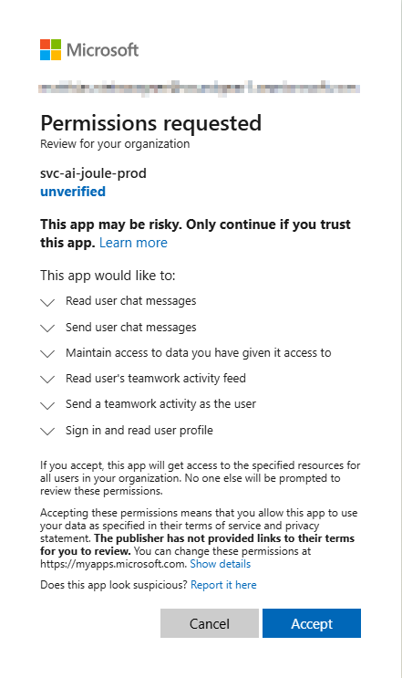
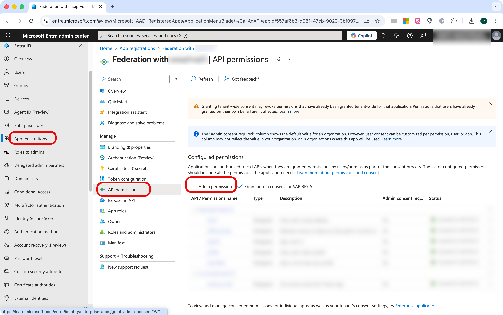
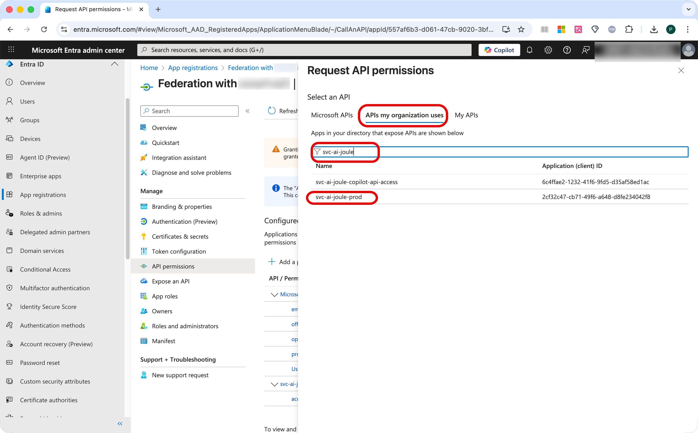
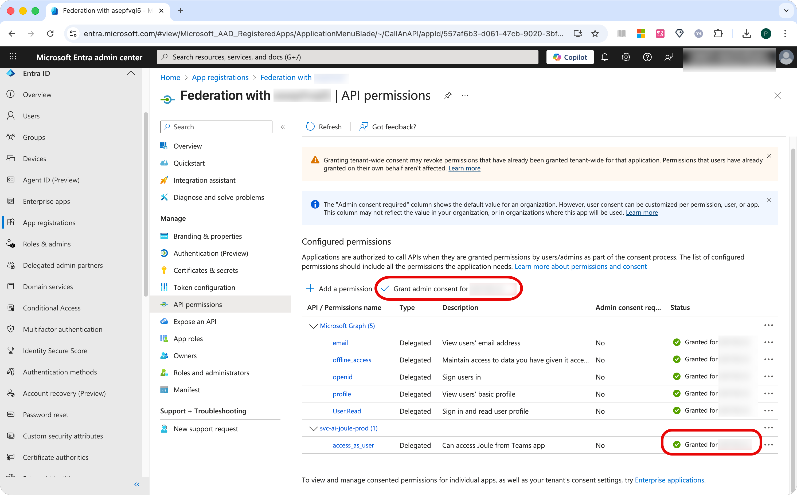
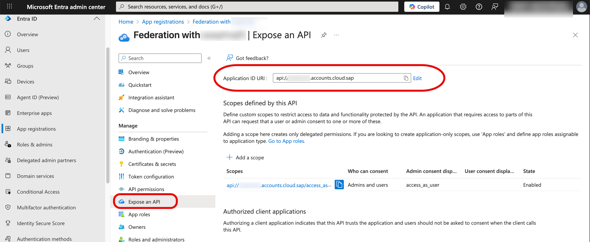
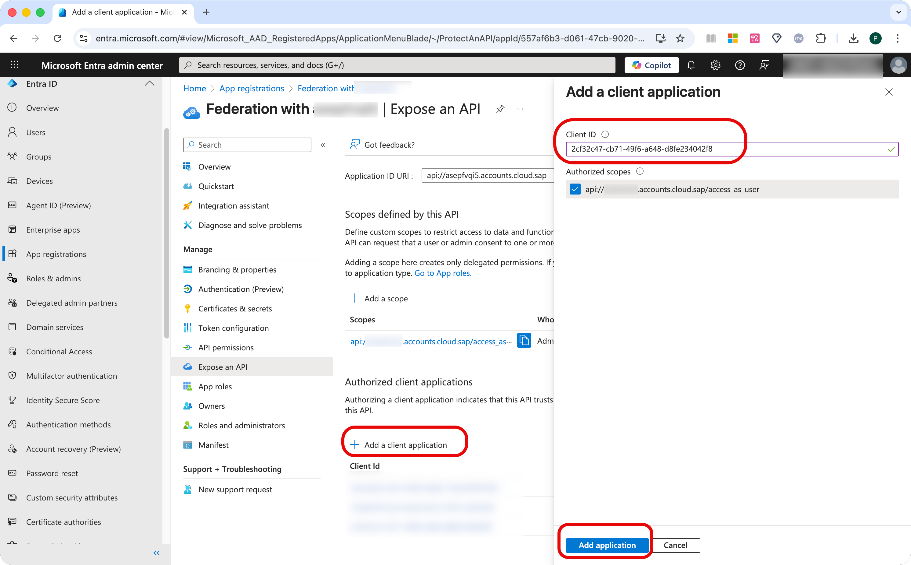
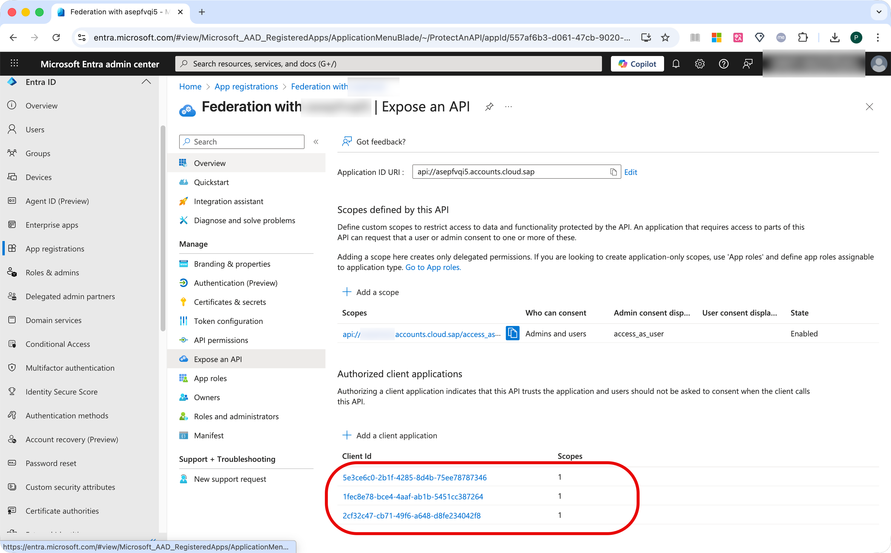

# Enable Microsoft Copilot and Teams to Pass Requests to Joule

Go to the Entra ID Admin Center with the admin user role.

## Add the SAP Teams-Bot Application

1. Open a text editor and copy this URL:
   [https://login.microsoftonline.com/](https://login.microsoftonline.com/)<tenant_id>/v2.0/adminconsent?client_id=2cf32c47-cb71-49f6-a648-d8fe234042f8&scope=2cf32c47-cb71-49f6-a648-d8fe234042f8/.default
2. Replace **<tenant_id>** with the directory (tenant) ID which you noted down during the registration of your federation app in Microsoft Entra ID in our previous blog [Configuring SAP Cloud Identity Services and Microsoft Entra ID for Joule](https://community.sap.com/t5/technology-blog-posts-by-sap/configuring-sap-cloud-identity-services-and-microsoft-entra-id-for-joule/ba-p/14105743 "Configuring SAP Cloud Identity Services and Microsoft Entra ID for Joule").
3. Open a browser, paste the URL and execute the request.
4. Log on with a user with the admin user role.
   A consent dialog appears.
5. Give your consent (accept).
   You can ignore error messages displayed in the browser.

   

## Configure API Permissions

1. Go to **Entra ID > App registrations** .
2. Choose your federation app.
3. Choose **API permissions**.
4. Choose **Add a permission**.

   
5. Choose **APIs my organization uses**.
6. Choose **svc-ai-joule-prod**.

   
7. Choose **Delegated Permissions** (default).
8. Enable the **access_as_user** permission.
9. Choose **Add permissions**.

   
10. Notice the new entry for **svc-ai-joule-prod** . Permissions aren't granted yet. Choose **Grant admin consent for** ***{Entra_ID_Tenant_Name}*** and choose **Yes**.

    
11. Verify that the status for **svc-ai-joule-prod** has changed to **Granted** .

## Expose APIs

1. Go to **Entra ID > App registrations** .
2. Choose your federation app.
3. Choose **Expose an API** .
> [!IMPORTANT]
> 4. Validate that you have already added the **Application ID URI**.
> 
>  
> 5. Choose **Add client application** and add the following client applications:
> 
>  1. 2cf32c47-cb71-49f6-a648-d8fe234042f8 (SAP Teams-Bot application)
>  2. 1fec8e78-bce4-4aaf-ab1b-5451cc387264 (Teams Desktop Application)
>  3. 5e3ce6c0-2b1f-4285-8d4b-75ee78787346 (Teams Mobile Application)
6. Enable any **Authorized scopes**.
7. Choose **Add application**.
8. Verify that all three applications are listed under **Authorized client applications**.

   
