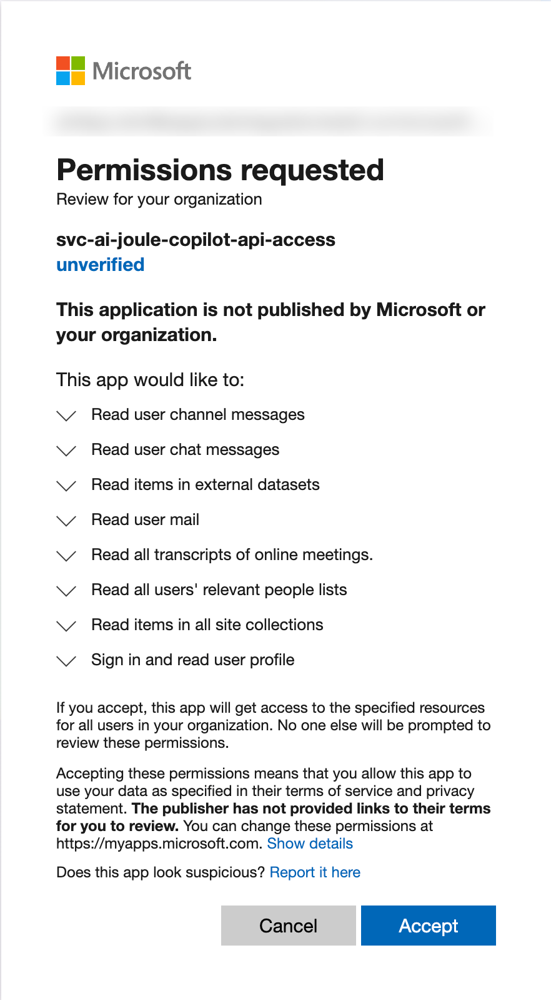
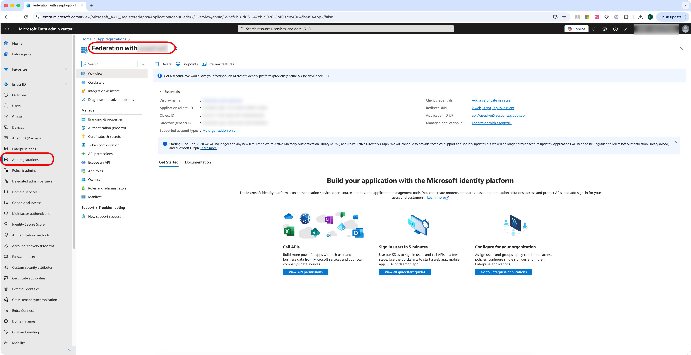
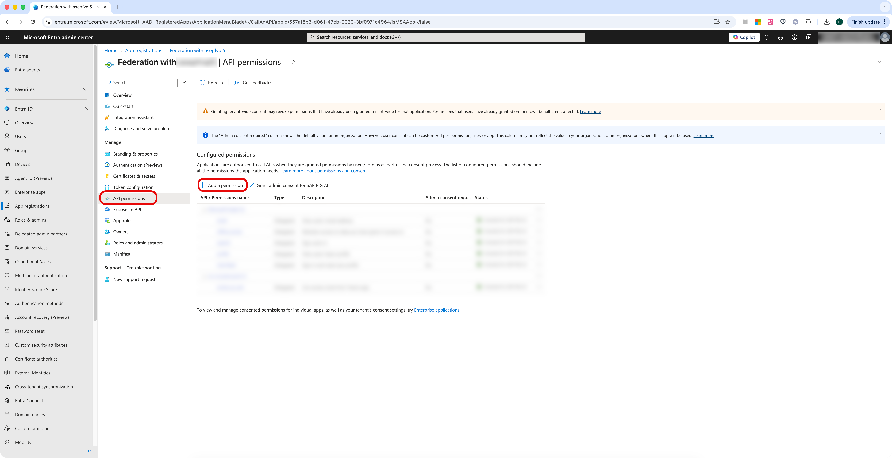
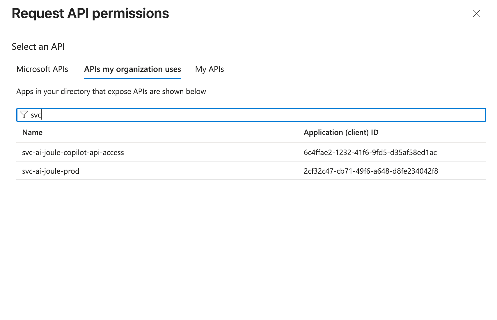
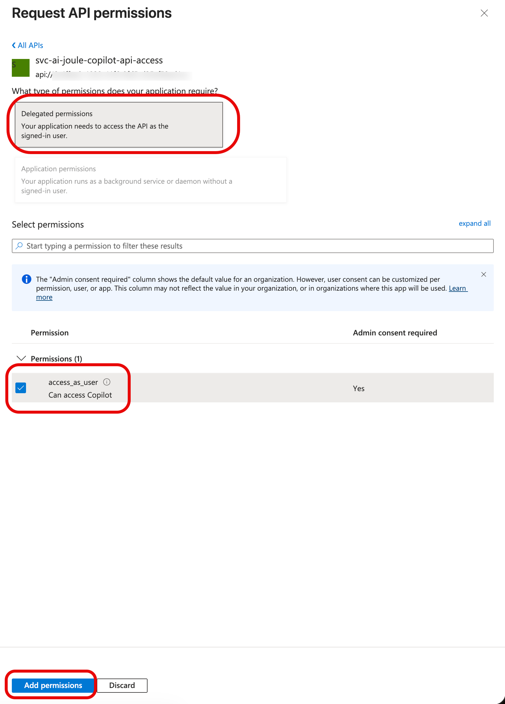
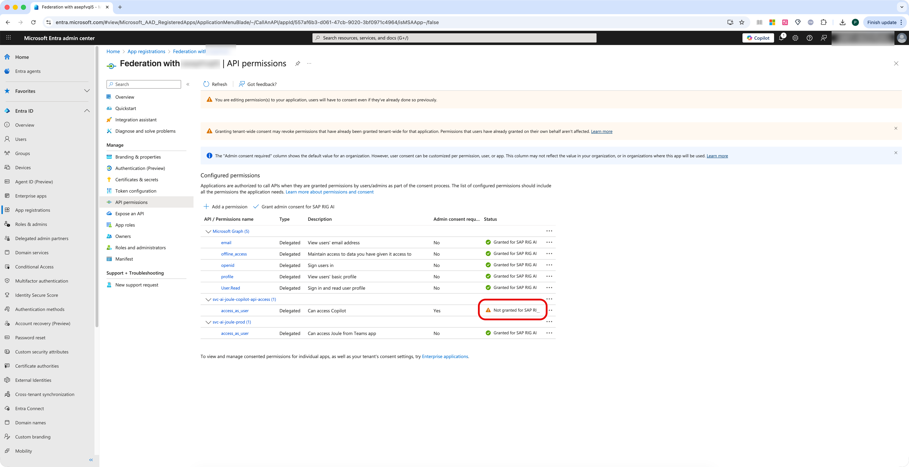
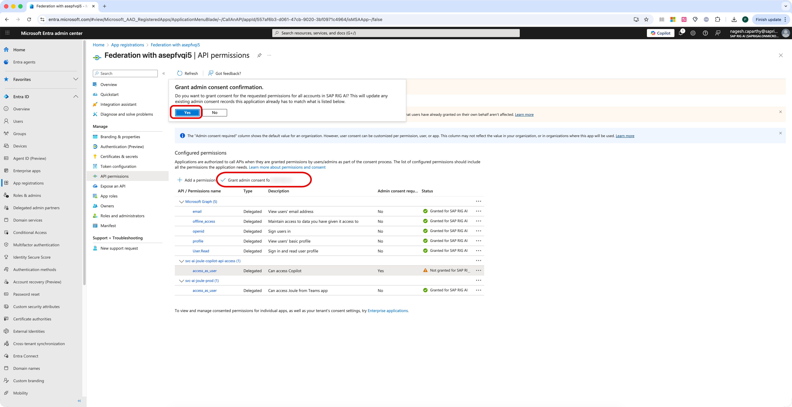
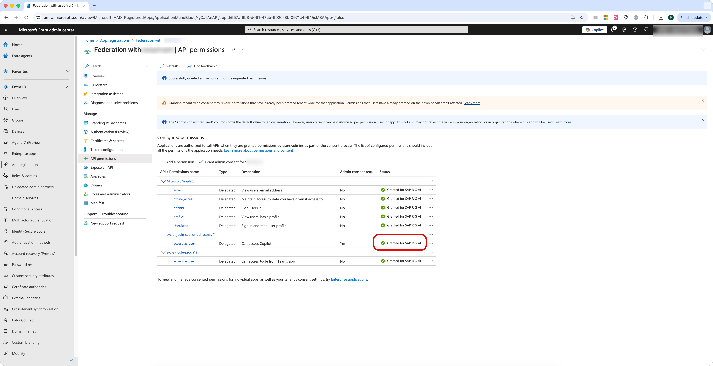

# Enable Joule to Pass Requests to Microsoft Copilot and Teams

Go to the Entra ID Admin Center with the admin user role.

## Add the SAP Copilot API Access Application

1. Open a text editor and copy this URL:
   [https://login.microsoftonline.com/](https://login.microsoftonline.com/)**<tenant_id>** /v2.0/adminconsent?client_id=6c4ffae2-1232-41f6-9fd5-d35af58ed1ac&scope=6c4ffae2-1232-41f6-9fd5-d35af58ed1ac/.default
2. Replace **<tenant_id>** with the directory (tenant) ID which you noted down during the registration of your federation app in Microsoft Entra ID in our previous blog [Configuring SAP Cloud Identity Services and Microsoft Entra ID for Joule](https://community.sap.com/t5/technology-blog-posts-by-sap/configuring-sap-cloud-identity-services-and-microsoft-entra-id-for-joule/ba-p/14105743 "Configuring SAP Cloud Identity Services and Microsoft Entra ID for Joule").
3. Open a browser, paste the URL and execute the request.
4. Log on with a user with the admin user role.
   A consent dialog appears.
5. Give your consent (accept).
   You can ignore error messages displayed in the browser.

## Configure API Permissions

1. Go to **Home > App registrations** .
2. Choose your federation app.

   
3. Choose **API permissions** .
4. Choose **Add a permission** .

   
5. Choose **APIs my organization uses** .
6. Choose **svc-ai-joule-copilot-api-access** .

   
7. Choose **Delegated Permissions** (default).
8. Enable the **access_as_user** permission.
9. Choose **Add permissions** .

   

   Notice the new entry for **svc-ai-joule-copilot-api-access**. Permissions aren't granted yet.

   
10. Choose **Grant admin consent for** ***{Entra_ID_Tenant_Name}*** and choose **Yes** .

    
11. :exclamation:Verify that the status for **svc-ai-joule-copilot-api-access** has changed to **Granted** .

    

Recap: Enable Joule to send requests to Microsoft Copilot and Teams by granting admin consent for the SAP Copilot API Access app and configuring delegated API permissions for svc-ai-joule-copilot-api-access in Entra ID.
