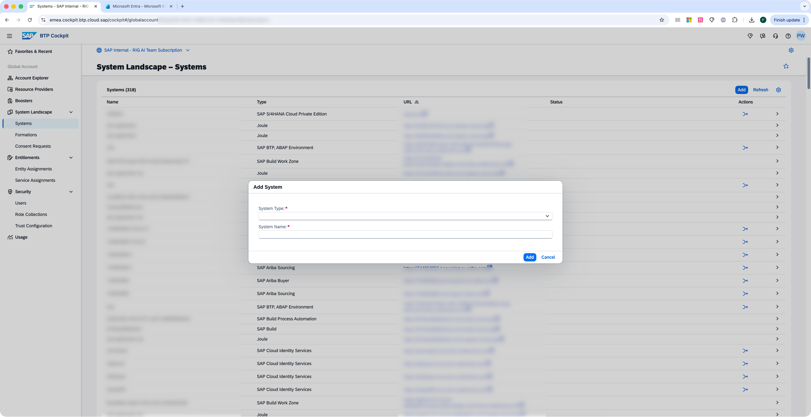
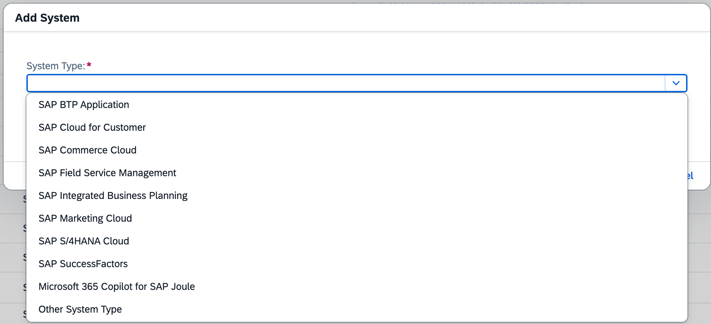
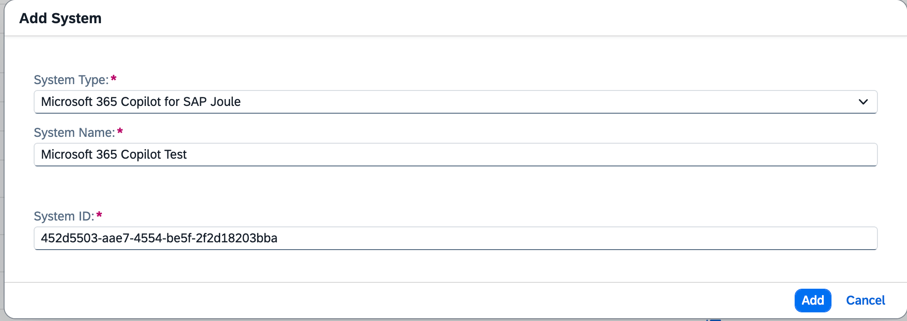
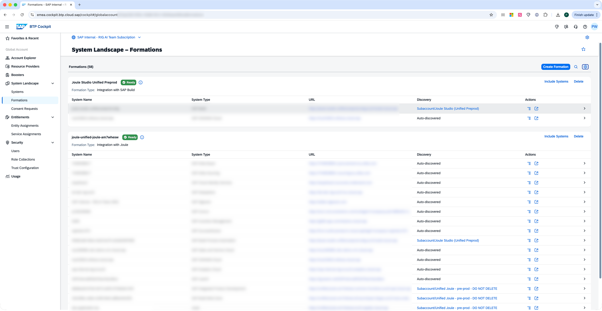
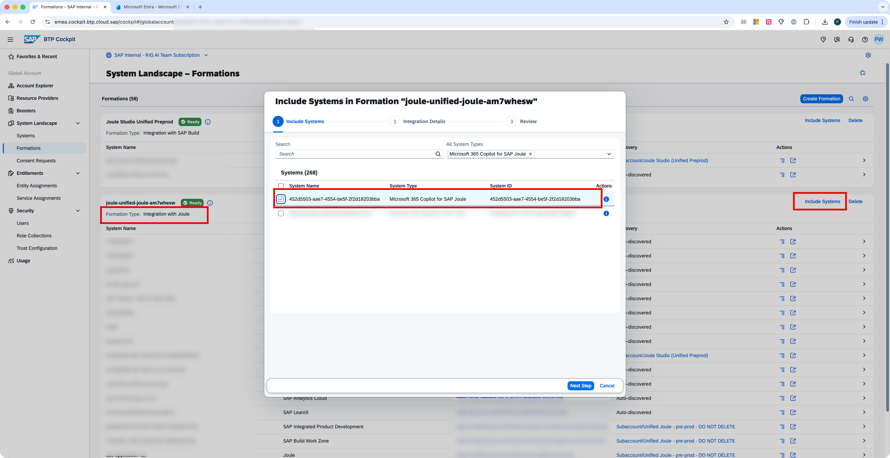
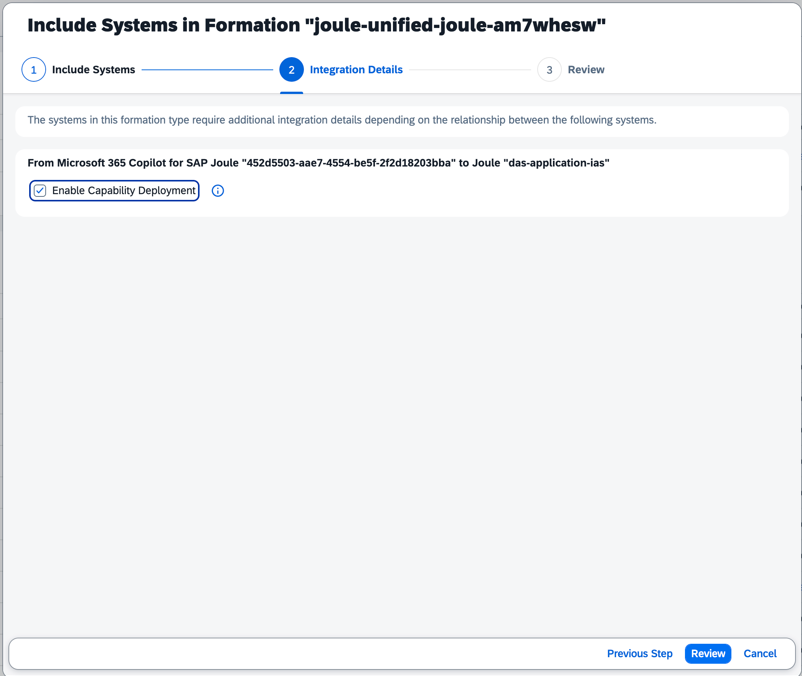
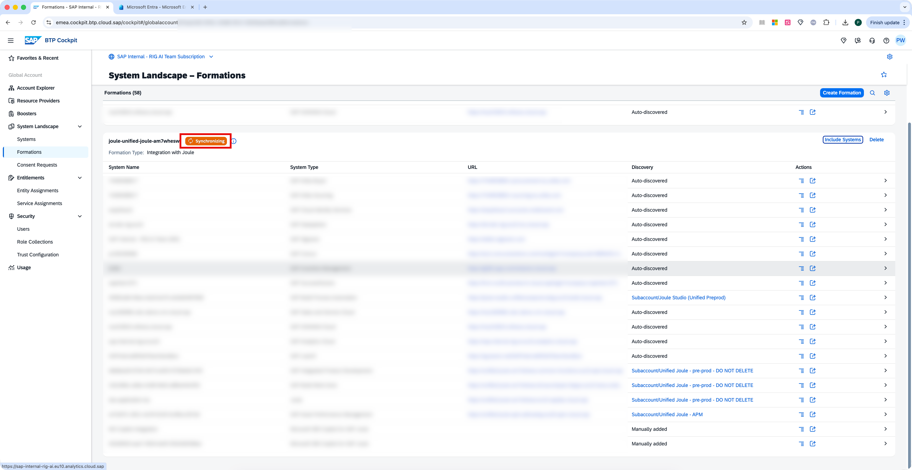
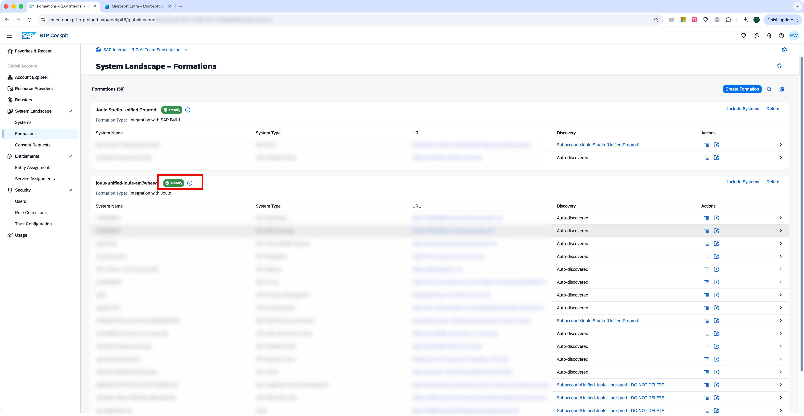

# Run Booster / Add Formation

Add a system of type **Microsoft 365 Copilot for SAP Joule** to your system landscape and add this system to your Joule formation.

* If you are setting up a tenant for the first time, use the Joule booster. For more information, see Run the Joule Booster in the Joule Documentation, see [Run the Joule Booster in the Joule Documentation](http://help.sap.com/docs/JOULE/6189c8655c484916bb8eb767126a653a/34157c476600476cb9180062db6002af.html?version=CLOUD "Run the Joule Booster in the Joule Documentation").
* As a prerequisite that you should have at least one system integration with Joule like S/4HANA, SuccessFactors, etc. Since you have already done this setup, all you need to do is include the Microsoft 365 Copilot to the existing Joule formation. [Include or Exclude a System in the Joule Formation](https://help.sap.com/docs/joule/integrating-joule-with-sap/run-booster#include-or-exclude-a-system-in-the-joule-formation "Include or Exclude a System in the Joule Formation")

## Add the Microsoft 365 Copilot System to BTP Landscape

Before including a system into an existing formation, you need to make sure the system is already added in BTP system landscape:

1. Log in to the SAP BTP account as global account administrator.
2. In the left navigation pane of the global account, click System Landscape.
3. Under System Lanscape, click on Systems.
4. Check whether the target Microsoft 365 Copilot system is existed in the list, if yes, you can skip below steps and move "Include the Microsoft 365 Copilot to an existing Joule formation" section. Otherwise, click Add button.

   

5. In the "System Type" drop down, select Microsoft 365 Copilot for SAP Joule.

   

6. Input a proper System Name and System ID. Click Add.

   

## Include the Microsoft 365 Copilot to an existing Joule formation

To include a system in an existing formation:

1. Log in to the SAP BTP account as global account administrator.
2. In the left navigation pane of the global account, click System Landscape.
3. Under System Landscape, click on Formations.

   

4. Choose an existing Joule formation (with formation type: Integration with Joule or Integration with Joule
   Preview), which is in Ready state for which you wish to include an additional system. Click Include Systems.
   The Include Systems dialog opens up.
5. Select the system which you want to include in the formation.

   

6. Click Next Step.
7. For each system, select from the following 2 options:
8. Enable Capability Deployment.

   

9. Click Review.
10. Review the changes and click Include. The formation will be in Synchronizing status for few minutes.

   

11. Waiting until the status changes to Ready, which indicates that the Microsoft 365 Copilot system is added into formation successfully.

   
