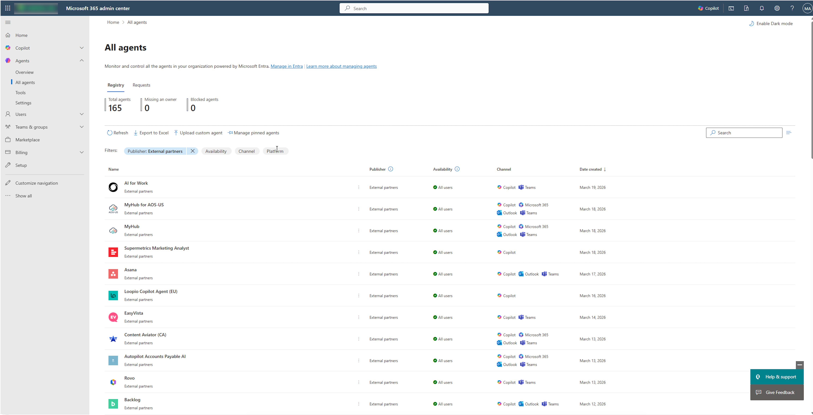
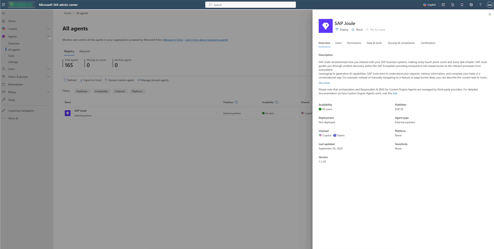
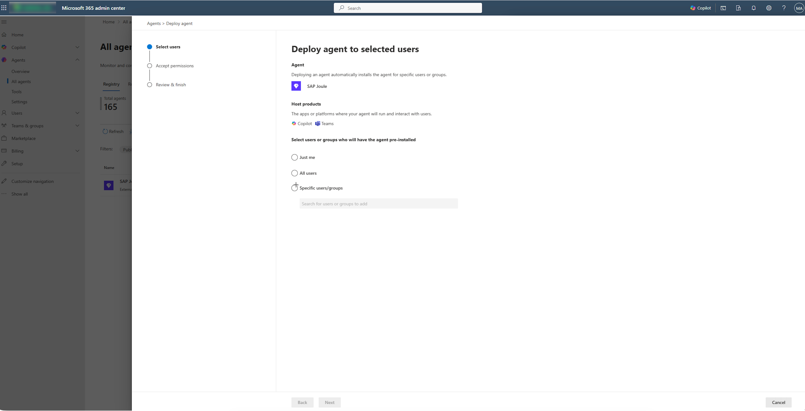
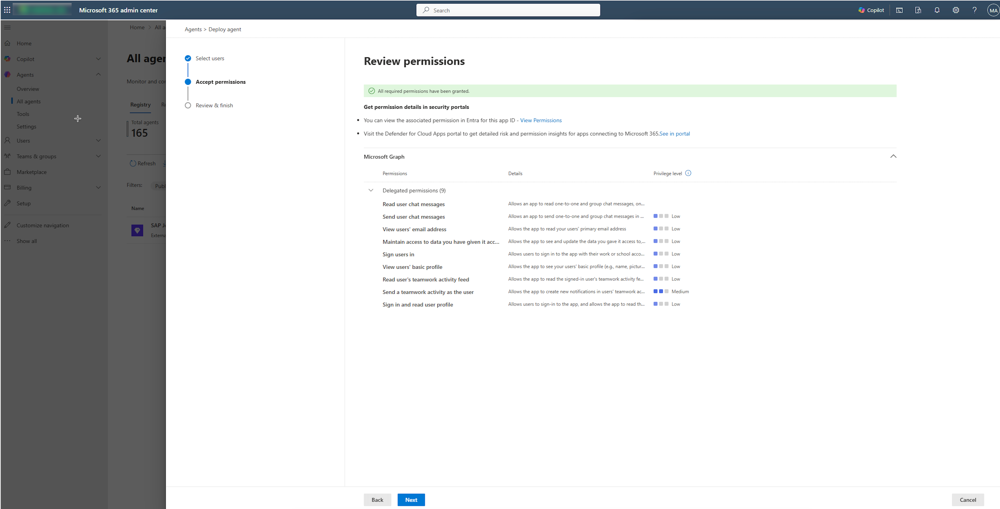
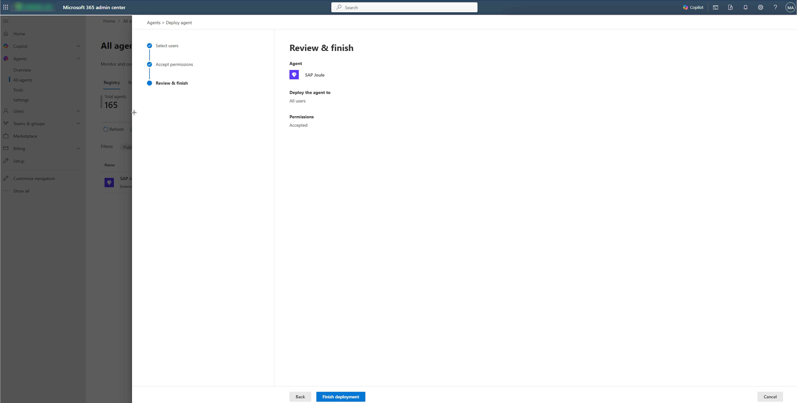

# Install SAP Joule via Microsoft 365 Admin Center

Install the [SAP **Joule** app](https://help.sap.com/docs/link-disclaimer?site=https%3A%2F%2Fappsource.microsoft.com%2Fen-us%2Fproduct%2Foffice%2Fwa200008645 "https://appsource.microsoft.com/en-us/product/office/wa200008645") via the Microsoft 365 Admin Center.

**Step 1: Installation Prerequisite: Admin Role & Permissions**

Before beginning installation of the SAP Joule Copilot Agent, confirm:

• You are a Microsoft 365 global admin

• You can grant admin consent for organization-wide applications.

If you don’t have these rights, contact your Microsoft 365 administrator before proceeding.

**Step 2: Installing the SAP Joule Copilot Agent**

A Microsoft administrator must install the SAP Joule agent within your organization’s Microsoft 365 tenant:

1. Go to the  [admin.microsoft.com](https://admin.microsoft.com/ "https://admin.microsoft.com/")
2. Navigate to **Agents**

   

3. Search for **SAP Joule**

   

4. Click on **Deploy**, and select users or groups to install the agent

   

5. Review the **requested permissions**

   * Read user chat messages - Allows an app to read 1 on 1 or group chats threads, on behalf of the signed-in user.
   * Send user chat messages - Allows an app to send one-to-one and group chat messages in Microsoft Teams, on behalf of the signed-in user.
   * Maintain access to data you have given access to - Allows the app to see and update the data you gave it access to, even when users are not currently using the app. This does not give the app any additional permissions.
   * Read user's teamwork activity feed - Allows the app to read the signed-in user's teamwork activity feed.
   * Send a teamwork activity as the user - Allows the app to create new notifications in users' teamwork activity feeds without a signed in user. These notifications may not be discoverable or be held or governed by compliance policies.
   * Sign in and read profile - Allows users to sign-in to the app, and allows the app to read the profile of signed-in users. It also allows the app to read basic company information of signed-in users.

   

6. Finish deployment.  Changes may take several hours to propagate across your organization.

   

[Manage agents in the Microsoft 365 admin center - Microsoft 365 admin | Microsoft Learn](https://learn.microsoft.com/en-us/microsoft-365/admin/manage/manage-copilot-agents-integrated-apps?view=o365-worldwide "https://learn.microsoft.com/en-us/microsoft-365/admin/manage/manage-copilot-agents-integrated-apps?view=o365-worldwide") for more information on how to manage copilot agents in M365 Admin center
[Agent Settings in Microsoft 365 admin center - Microsoft 365 admin | Microsoft Learn](https://learn.microsoft.com/en-us/microsoft-365/admin/manage/agent-settings?view=o365-worldwide "https://learn.microsoft.com/en-us/microsoft-365/admin/manage/agent-settings?view=o365-worldwide") for more information on agent settings and control.

**Note**

* After installing the M365 Custom Engine Agent via the M365 Admin Center and doing all setup steps, it may take up to two hours until the Joule Agent can be accessed from within M365 Copilot Chat.
* SAP does not control data processed by Microsoft 365 Copilot, the decision to use Microsoft 365 Copilot is up the customer and all use of Microsoft 365 Copilot is subject to the terms of the agreement between the customer and Microsoft.
