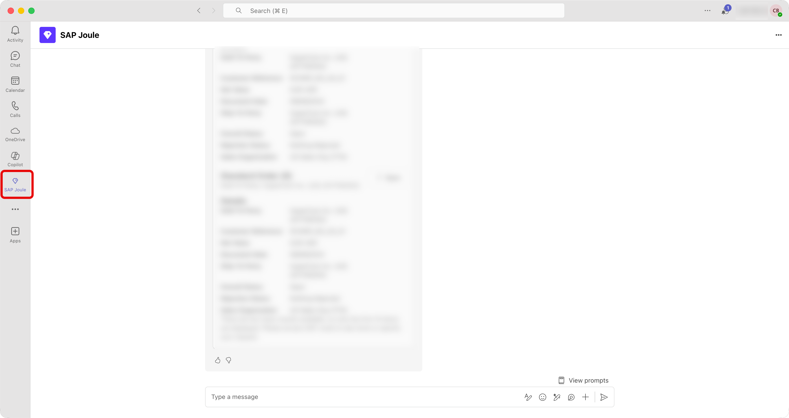
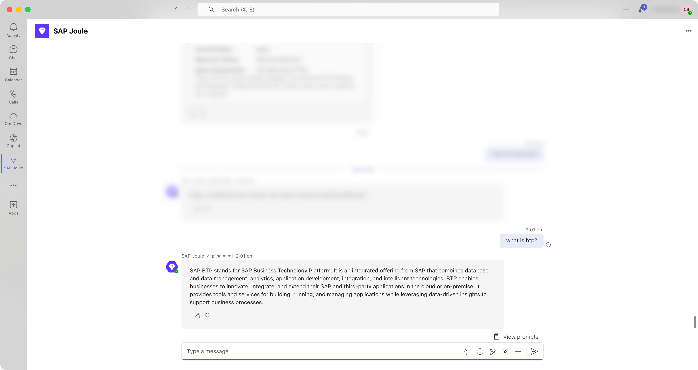
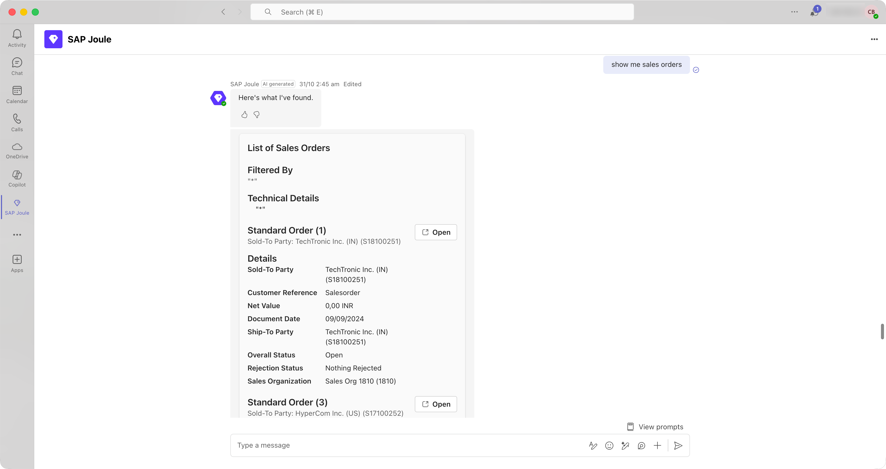
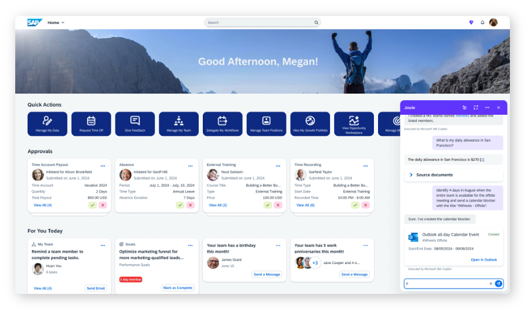
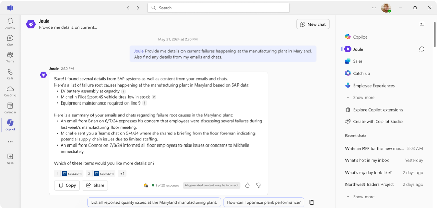

# Test Scenarios

Now you should be able test some scenarios to understand how Joule works with Microsoft 365 Copilot, below are some examples.

1. Talk with SAP Joule in Microsoft Teams to access LoB application business data

Open Microsoft Teams, followed by previous **Setup** section, you should be able to see **SAP Joule** on the left side menu. Click it to open the dialog.

    

Test information capability by prompt like "what is btp?":

    

Depending on your LoB systems connected to Joule, you can use prompt based on the target system's use case. If you connected Joule with S/4 Cloud ERP system, you can try "show me sales order":

    

2. Use Joule within the SAP system to seamlessly access data from Microsoft 365 applications, including Outlook, Word, and Excel.

For example, you can ask Joule to review calendar availability for your team members:

    

3. Even more powerfully, Joule can deliver insights by combining business data from the SAP system with information from Microsoft 365.

    

## End-to-End Demo

    <video width="800" height="600" controls>
        <source src="assets/JouleCopilotDemoRecording.mov" type="video/mp4">
    </video>

