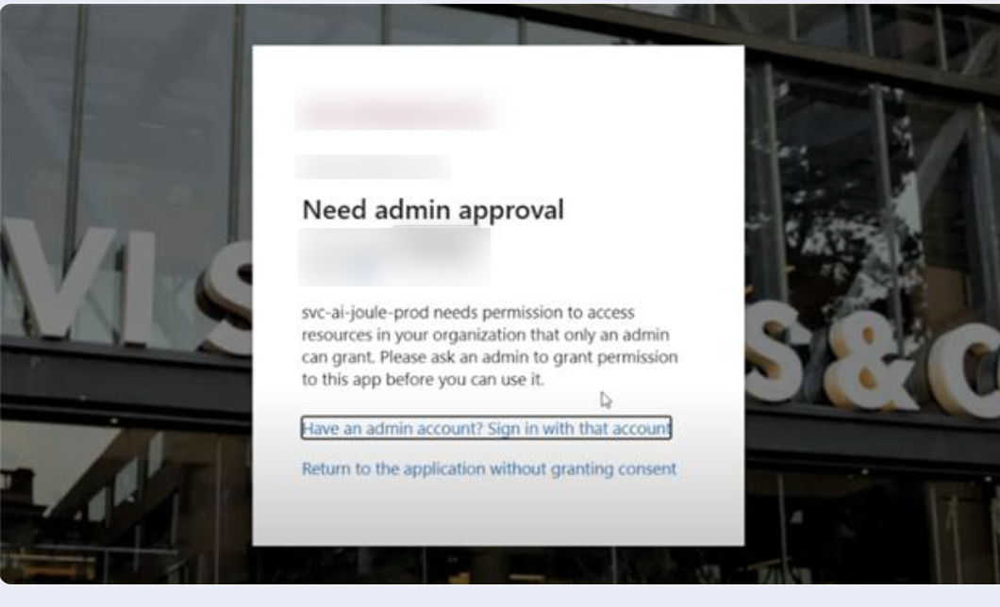
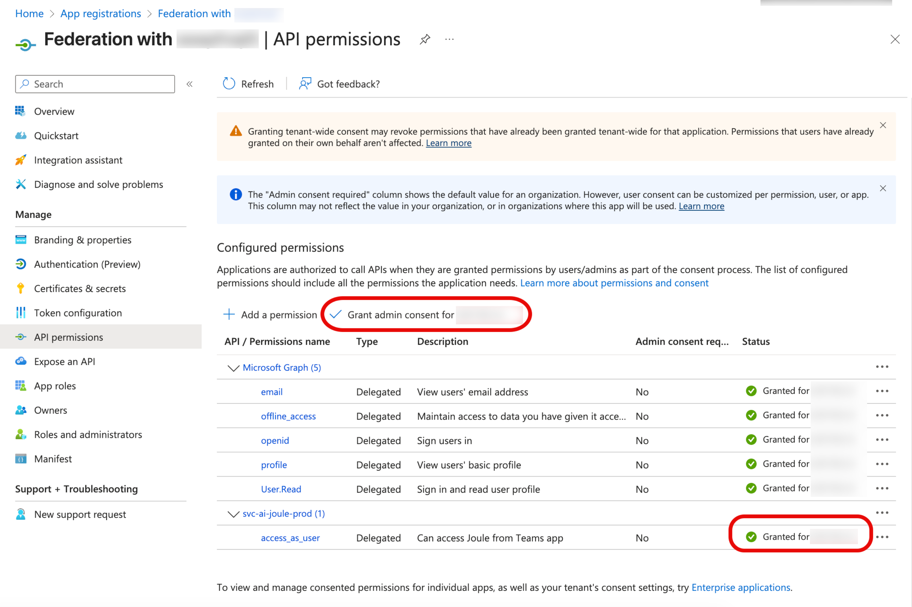
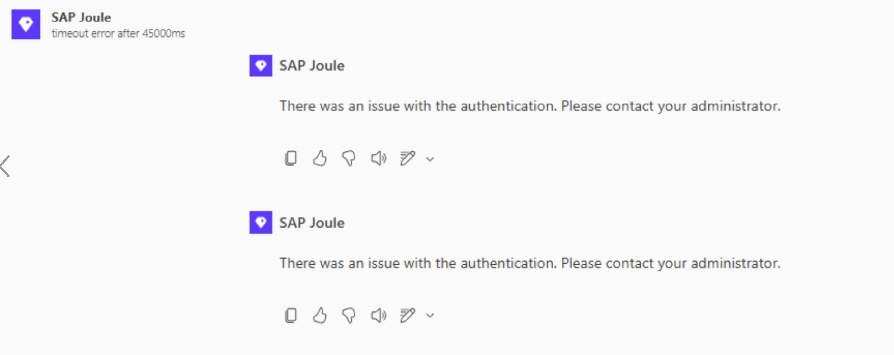
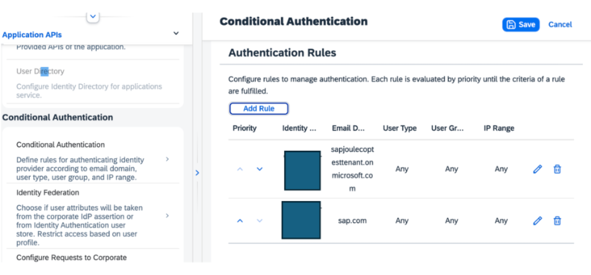
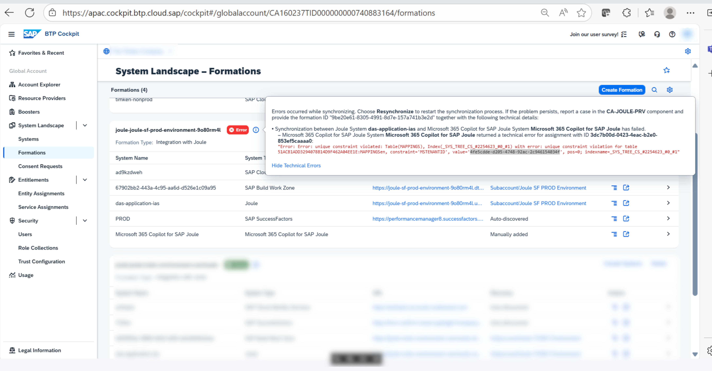

# Frequently Occurring Issues

## 1. Joule integration with MS Copilot fails – user gets “Sorry, I wasn’t able to respond”.

Fix:

1. Verify the set up is correct according to the Setup pillar in this mission.
2. Raise a ticket to component CA-Joule with tenant id/Subaccount ID for further investigate.

## 2. Joule in Teams does not provide follow-up links to Fiori.

Fix:

1. if an UI element is not rendering correctly in a response on ms-bot, first thing to check if the same response is seen on webClient. If the response is same on both clients, then the issue is not specific to ms-bot. If the issue is only on ms-bot, follow the step below.
2. Raise a ticket to component CA-Joule with tenant id/Subaccount ID, attach an issue screenshot in the ticket.

## 3. Need admin approval when trying to access Joule.

Reason: Admin has not yet granted the permissions for svc-ai-joule-prod API

Fix: The required steps are documented in Task - Enable Microsoft Copilot and Teams to Pass Requests to Joule.

## 4. Error - There was an issue with the authentication. Please contact your administrator.

Reason: The issue arises when the Miscrosoft Entra and IAS setup is not configured correctly.

Fix: You need to configure IAS and Entra to trust each other and the conditonal authentication in IAS is setup correctly for Joule. This is all expained in the Task - Configure Microsoft Entra ID as Identity Provider for Joule.

To facilitate your diagnose process, follow below steps:

As a first step, please check the Kibana logs in the respective env where this issue occurs. The issue could occur for any of the following errors/reasons:

1. Error fetching IAS token: AxiosError: Request failed with status code 400

* **Wrong conditional authentication in IAS:** Ensure to add correct email domains of the users, please see the screenshot below

  
* **User is not added in the IAS tenant:** Make sure user accessing MS teams is also added in the IAS tenant and the email is verified.
* **Subject Name Identifier: ** Make sure subject name identifier is set/enabled for email in IAS.

2. Error fetching OBO token: AggregateError: All promises were rejected

* Configuration is not correct in the Microsoft Entra causing the first token exchange (OBO token) fail. Please check and make sure configuration on the Entra side is correct as per the document above.

## 5. Unable to view and access Joule in M365 Copilot

Please ensure SAP Joule app is installed by following up "**Connecting Microsoft M365 Copilot to Joule**" section in following link: https://help.sap.com/docs/joule/integrating-joule-with-sap/integrating-joule-with-microsoft-365-copilot .

If joule not visible in your Teams app list, it may not be enabled or allowed by organization's admin. There is a note in guideline: [https://help.sap.com/docs/joule/integrating-joule-with-sap/integrating-joule-with-microsoft-365-copilot](https://help.sap.com/docs/joule/integrating-joule-with-sap/integrating-joule-with-microsoft-365-copilot)

## 6. Error while Synchronizing - Unique constraint voilated

Reason: There is MS tenantID entry already exists in the DB maybe it was added previously by creating a formation and hence a unique constraint error.

Fix: Try to exclude the Microsoft 365 system from the formation and include the same again, this will help removing the existing entry in DB, which will help to resolve the issue.

You should be able to remove the misconfigured system from the Systems tab by clicking the row in the table and clicking the Remove button if you want to remove it from the Global Account.

## 7. Error - SAP Joule does not seem to be set up for your tenant. Please contact your administrator to check the prerequisites and set up the integration.

Fix: Check if system of type **Microsoft365 Copilot for SAP Joule** still exists in the formation and is not unassigned for this tenant. Also, the issue can be resolved by unassigning and assigning the system type which should then create APIM mappings.

Try to exclude the Microsoft 365 system from the formation and include the same again, this will help removing the existing entry in DB, which will help to resolve the issue.
